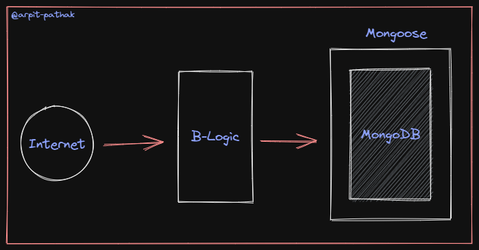

# 🔰 Designing Backend and Auth 🔰 ⚙

## 🔷 **dotenv**
The dotenv(.env) package is a great way to keep password, API keys and other sensitive data out from your code.
Dotenv is a zero-dependency module that loads environment variables from a `.env` file into `process.env`. 



## 🔷 **Business Logic**
 Business Logic is the layer that decides what should happend to the data that is sent to the database or sent out of th database.

## 🔷 **Model**
Model is the folder location where we define the format of collections that we store in the mongodb database.

## 🔹Reason for `npm i -D nodemon`
If you do it without -D devdependencies then it will get installed as a regular dependency and will be bundled together with your production app increasing the size and adding unnecessary dependency.

### Devdependencies like `nodemon` we don't want to package for final build of the application (only for development purpose on local)

## 🔹 What is `package-lock.json`
It holds the exact snapshot version, link from where the package is downloaded and hash value to verify this is a valid package that is getting installed.

## 🔹 Tips for dotenv .env file 
- We always write in Capital letters PORT = 4000
- Atleast once we have to bring `.env` inside app.js
- Bring `.env` before `express` because the PORT need to get loaded first and then on that PORT you will be able to run.
- Dont put `(;)` semicolumn inside `.env` file.
- `process.env.PORT` it is internally this `const {PORT} = process.env`
- ```require ('dotenv).config() ``` config() loads `.env` file contents into `process.env`

- Config({abc}) if there something is passed in this then your `.env` is not in the root directory, it is kept somewhere else.

## 🔹 `require` vs `import`
Because node.js does not support ES6 syntax out of the box. It uses common js syntax and hence we use require to import

---
## what we learn till now
- Express
- req and res
- How to send the Response
- PORT
- Nodemon
- Postman
- API
- Status Code
- Web Requests - get put

## 05 Nov class

- Nothing was perm
- How to inject DB
- 12345667 => Hide Secret (HMAC SHA256)
- How we can Protect Routes
- process.env 

>if you dont know you learn and if you know you revise.

Schema design tool
- sqldbm(paid)
- miro (free)


> by [@Arpit-pathak](https://www.linkedin.com/in/arpit-webdev/) 

---
[](https://www.linkedin.com/in/arpit-webdev/)
[](https://github.com/arpit-pathak)
[](https://www.instagram.com/arpit.code/)