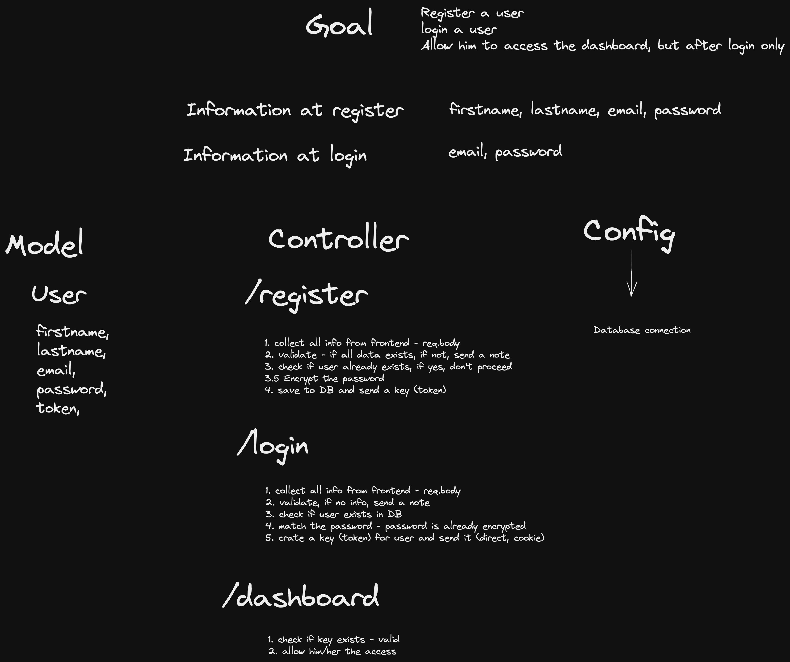

# 🔰 Semi Auth 🔰

# Goal 
- Register a user
- Login a user
- Allow him to access the dashboard, but after login only

Information at register   --> firstname, lastname, email, password

Information at Login      --> email, password

> You do not ever jump into writing the code directly you first go ahead and defined what you really want to do

mvc and mvvm architecture, the idea behind that you saprate your files

# Model
## user
firstname,
lastname,
email,
password,
token


# Controller
## /register
1. collect all info from frontend - req.body
2. validate - if all data exists, if not, send a note
3. check if user already exists, if yes don't proceed
3.5 Encrypt the password
4. save to DB and send a key(token)

## /login
1. collect all info from frontend - req.body
2. validate, if no info, send a note
3. check if user exists in DB
4. match the password - password is already encrypted
5. create a key(token) for user and send it (direct send, cookie)

## /dashboard
1. check if key axists - valid 
2. allow him/her the access

# Config
### Database connection

# Mindmap


--> For token we use [jsonwebtoken](https://www.npmjs.com/package/jsonwebtoken)

--> For password encryption we use [bcryptjs](https://www.npmjs.com/package/bcryptjs)

Schema === Structure
_____________________________________
## Model/ user.js

```
module.exports = mongoose.model("user", userSchema);
```
> In the mongoDB we don't have casing so if we have `User` or `user` it will be stored as all **`Lower Case`**.

>And MongoDB automatically **`pluralize`** all of your schema.So when we see `User` in MongoDB it will stored as `users`

## Controllers

## /register

### encrypt the password
```
const myEnnypassword = await bcrypt.hash(password, 10);
```
### create a new entry in database
```
    const user = await User.create({
      firstname: firstname,
      lastname,
      email,
      password: myEnnypassword,
    });
````

- Firstname, lastname, email, password form lefthand side is `variable from model/key form schema`.

- And Righthand side are variables from `req.body`.

### create a token and send it to user
```
    const token = jwt.sign(
      {
        id: user._id,
        email: email,
      },
      "shhhh",
      { expiresIn: "2h" }
    );


    user.token = token // send to user
```
### Syntax
```
const = token = jwt.sign({payload}, "secret", {options});
```
## /login

### match the password
```
await bcrypt.compare(password, user.password)
```
- first parameter  - string
- second parameter - hash 
- await because it takes time to compare

### Send cookie to frontend
```
const options = {
  expires: new Date(Date.now() + 3 * 24 * 60 * 60 * 1000),
  httpOnly : true
  };
  res.status(200).cookie("token",token,options).json({
    sucess: true,
    token,
    user
  })
}
```
- 1st parameter is (string) Name of the cookie
- 2nd parameter is Value
> by Arpit-pathak

---
[](https://www.linkedin.com/in/arpit-webdev/)
[](https://github.com/arpit-pathak)
[](https://www.instagram.com/arpit.code/)